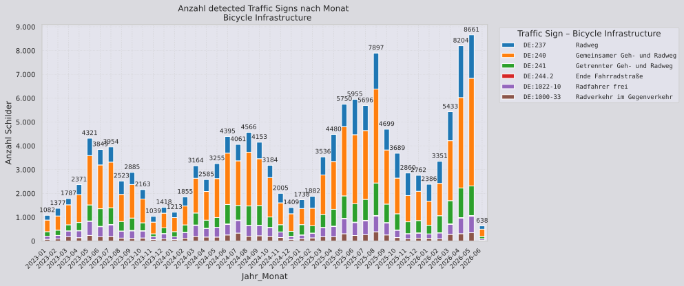

# Bicycle Infrastucture Traffic Signs Output

This folder contains the output file for detected traffic signs related to bicycle infrastructure from Mapillary.  
The output has been created on **2026-07-22**.

## Applied Filters

- Only detections newer than **2023-01-01**
- Excluded all signs located within **30 m of motorways** (to reduce false positives)

## Signs

| VZ-Code | Beschreibung | Verkehrszeichen | Anzahl | Mapillary Wording |
|-------|-------------|:---------------:|-------:|-----------------|
| DE:237 | Radweg |  | 30800 | `regulatory--bicycles-only--g1` |
| DE:240 | Gemeinsamer Geh- und Radweg |  | 71219 | `regulatory--shared-path-pedestrians-and-bicycles--g1` |
| DE:241 | Getrennter Geh- und Radweg |  oder  | 24453 | `regulatory--dual-path-pedestrians-and-bicycles--g1` `regulatory--dual-path-bicycles-and-pedestrians--g1` |
| DE:244.2 | Ende Fahrradstraße |  | 525 | `regulatory--end-of-bicycles-only--g2` |
| DE:1022-10 | Radfahrer frei |  | 15319 | `complementary--except-bicycles--g1` |
| DE:1000-33 | Radverkehr im Gegenverkehr |  | 7738 | `complementary--bike-route--g1` |

## Statistics Plot

## Downloads

The files in this folder are also published for direct download, so consumers do
not need to clone this repository:

| File | Download |
| --- | --- |
| 🗺️ Vector tiles (PMTiles) | <https://data.vizsim.de/mapillary_trafficsigns/cycleway-campaign/mapillary_trafficsigns_bicycle_latest.pmtiles> |
| 📦 GeoJSON (gzip) | <https://data.vizsim.de/mapillary_trafficsigns/cycleway-campaign/mapillary_trafficsigns_bicycle_latest.geojson.gz> |

Data © Mapillary, redistributed under [CC BY-SA 4.0](https://creativecommons.org/licenses/by-sa/4.0/).
