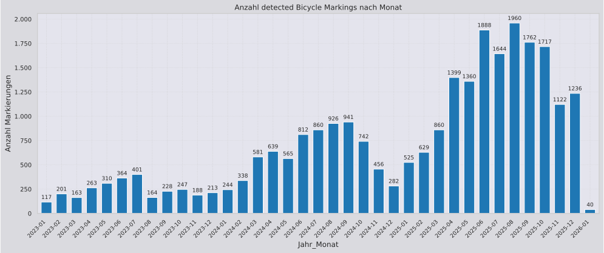

# Bicycle Marking Detections Output

This folder contains the output file for detected bicycle markings from Mapillary.  
The output has been created on **2026-01-18**.

## Overview

- **Total detections**: 26492
- **Mapillary dataset from**: 2026-01-18
- **Detection period**: 2014-03-30 00:00:00 - 2026-01-15 00:00:00
- **Marking type**: Lane marking - symbol (bicycle)

## Applied Filters

- Only detections with **2+ observations** (min. 180 days apart)
- Only detections seen after **2023-01-01**
- Restricted to **Germany** boundaries

## Output Files

- `mapillary_markings_bicycle_latest.geojson.gz` - Compressed GeoJSON with all markings
- `markings_by_month.svg` - Detection frequency over time

## Statistics Plot

