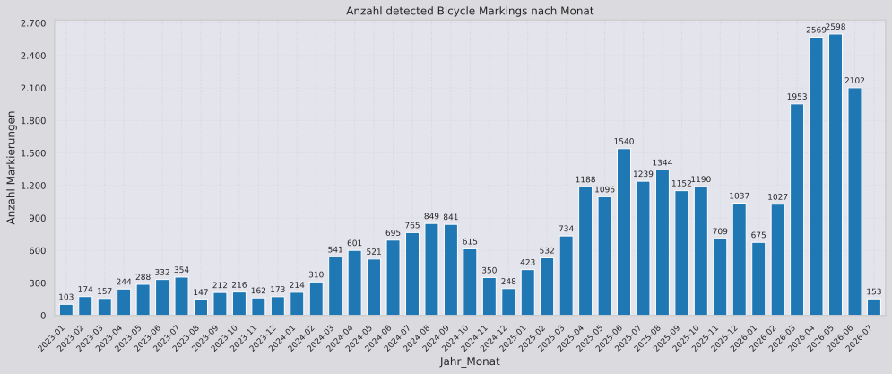

# Bicycle Marking Detections Output

This folder contains the output file for detected bicycle markings from Mapillary.  
The output has been created on **2026-07-23**.

## Overview

- **Total detections**: 32813
- **Mapillary dataset from**: 2026-07-23
- **Detection period**: 2014-03-30 00:00:00 - 2026-07-21 00:00:00
- **Marking type**: Lane marking - symbol (bicycle)

## Applied Filters

- Only detections with **2+ observations** (min. 180 days apart)
- Only detections seen after **2023-01-01**
- Restricted to **Germany** boundaries

## Output Files

- `mapillary_markings_bicycle_latest.geojson.gz` - Compressed GeoJSON with all markings
- `markings_by_month.svg` - Detection frequency over time

## Statistics Plot

## Downloads

The files in this folder are also published for direct download, so consumers do
not need to clone this repository:

| File | Download |
| --- | --- |
| 🗺️ Vector tiles (PMTiles) | <https://data.vizsim.de/mapillary_map-feature-points/cycleway-campaign/mapillary_markings_bicycle_latest.pmtiles> |
| 📦 GeoJSON (gzip) | <https://data.vizsim.de/mapillary_map-feature-points/cycleway-campaign/mapillary_markings_bicycle_latest.geojson.gz> |

Data © Mapillary, redistributed under [CC BY-SA 4.0](https://creativecommons.org/licenses/by-sa/4.0/).
